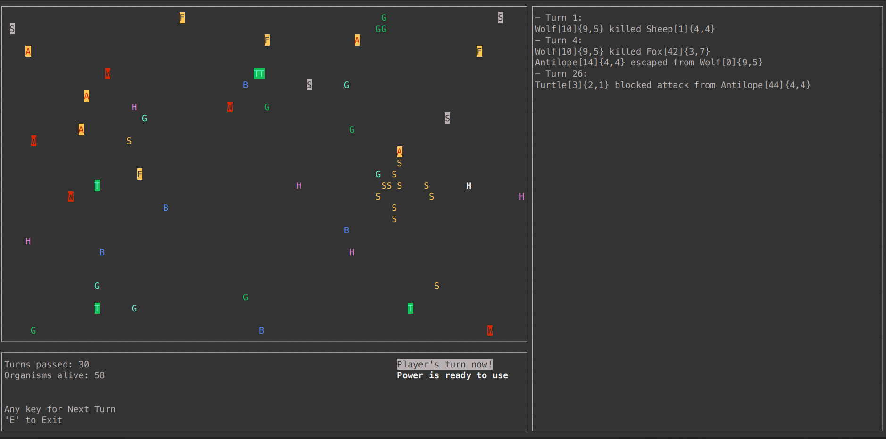

# Simple world simulation in C++
The project implements a virtual world simulator, which has simple life forms with different behavior. The user can participate in world simulation, being a "Human" organism. The aim of project was to exercise OOP in C++. It was meant to be run in console, so the visuals were made with *ncurses*.

- [Implementation in Java](https://github.com/axinterop/simple-world-sim-java)
- [Implementation in Python](https://github.com/axinterop/simple-world-sim-py) 

# Features
- Colorful world rendering (Renderer) and windows supported by *ncurses*.
- Log window to show events captured by EventListener.
- User-provided world size before simulation run.
- Different animal species and their reproduction.
- Different plant species and their propagation.
- User-controlled Human moved by arrows and Human's special skill.

# Screenshot

# Description of classes
**Note**
- Default collision() for every organism is killing or dying, depends on strength and initiative (except Grass and Sonchus).
- If there is empty cell in table, default behaviour is used.

## Human

  
| Strength | Initiative | action() | collision() |
| :--------: | :--------: | :--------: | :--------: |
| 5 | 4 | Human moves in the same way as animals, but the direction of his movement is not random, and corresponds to the arrow pressed by the player on the keyboard. I.e., if the player presses the arrow to the left, then (when it is the player's turn) the character will move one field to the left. | Human has a special skill that can be activated with a separate button on the keyboard. Once activated, the skill affects the behavior of the collision() method for five consecutive turns. After that, the skill is deactivated and cannot be activated again for the next five turns. **Skill**: invincibility - Human cannot be killed. If confronted with a stronger opponent, Human moves to a randomly selected adjacent field. |

## Animals
Default action() for every animal is moving randomly in any direction.

Cybersheep is not implemented in this project, but I have included it for completeness.

  
| Animal | Strength | Initiative | action() | collision() |
| :--------: | :--------: | :--------: | :--------: | :--------: |
| Wolf | 9 | 5 | - | - |
| Sheep | 4 | 4 | - | - |
| Fox | 3 | 7 | Good sense of smell: a fox will never move into a field occupied by an organism stronger than it. | - |
| Turtle | 2 | 1 | In 75% of cases, it does not changes its position. | Repels animal attacks with a strength of less than 5. The attacker must return to his previous field. |
| Antilope | 4 | 4 | The range of movement is 2 fields. | 50% chance of escaping before the fight. Then adjacent field. |
| Cybersheep | 11 | 4 | Her ultimate goal is to exterminate the Heracleum sosnowskyi. She always heads towards the nearest hogweed and tries to eat it. If there is no hogweed on the board then she pretends to be an ordinary sheep | Eats hogweed. | 

## Plants

- Default action() for every plant is an attempt to spread.
- All plants have initiative 0.

| Plant | Strength | action() | collision() |
| :--------: | :--------: | :--------: | :--------: |
| Grass | 0 | - | - |
| Sonchus | 0 | Makes three attempts to spread in one turn. | - |
| Guaranna | 0 | - | Increases the strength of the animal that ate this plant by 3. |
| Belladonna | 99 | - | The animal that ate the plant dies. | 
| Heracleum sosnowskyi | 10 | Kills all animals in its vicinity except the cyber-sheep | The animal that ate the plant dies except the cyber-sheep. |

---

# Details
Detailed description of simulation logic:
- The simulator is to be turn-based. In each turn, all organisms existing on the world are to perform an action appropriate to their type. Some of them will move (animal organisms), some will be stationary (plant organisms). 
- Each organism occupies exactly one field in the array, each field can contain at most one organism. In the event of a collision, one of the organisms wins, killing (e.g. wolf) or chasing away (e.g. turtle) its competitor. 
- The order in which the organisms move in a turn depends on their initiative. The animals with the highest initiative move first. In the case of animals with the same initiative, the order is determined by the seniority rule (the longer-lived one moves first). 
- Victory in an encounter depends on the strength of the organism, although there will be exceptions to this rule. With equal strength, the organism that attacked wins. 
- A specific type of animal is to be Human. Unlike animals, Human does not move at random. The direction of his movement is determined before the start of the turn by using the arrow keys on the keyboard. Human also has a special skill that can be activated with a separate button. The activated skill remains active for 5 consecutive turns, after which it is deactivated. Once deactivated, the skill cannot be activated until 5 consecutive turns have passed. 
- When the program is started, several pieces of all types of animals and plants should appear on the board each. The program window should contain a field where information about the results of battles, consumption of plants and other events occurring in the world will be written out.

